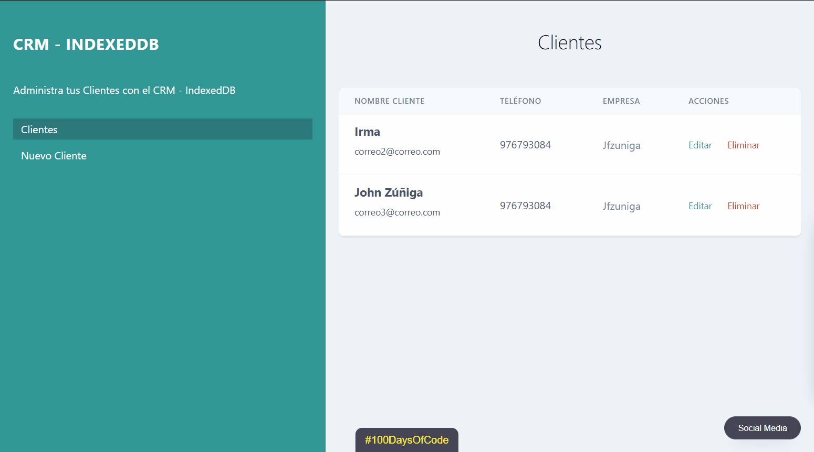

# CRM-Adm-practice

Práctica utilizando vanilla JaavaScript e IndexedDB para crear un CRM, e interatuar por medio de un CRUD.

<h2 align="center">
    
      https://jfelixzuniga.github.io/CRM-Adm-practice/
    
    
   
    
</h2>
